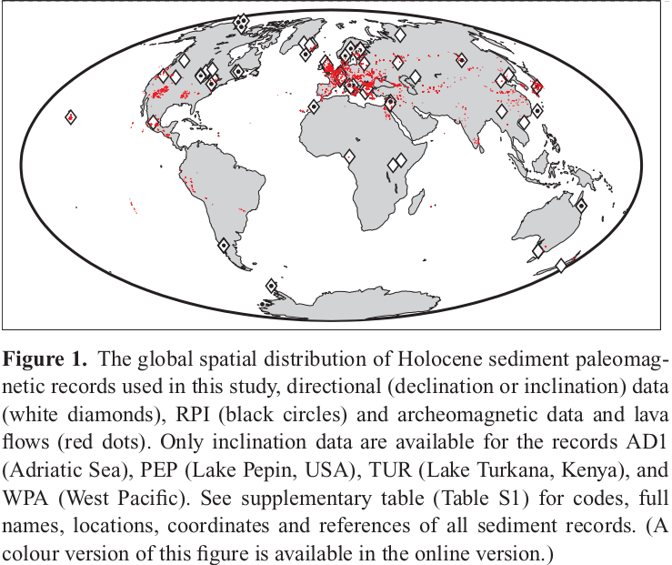
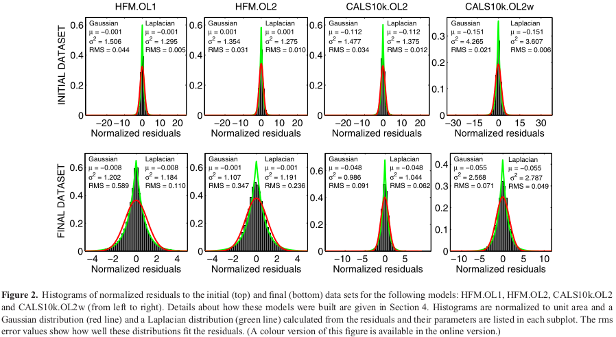

<!--
-------------------------------------------------------------------------------
This file defines the contents of each slide.
The reveal.js configuration can be found in index.html
-------------------------------------------------------------------------------
-->

<!-- .slide: class="slide-title" data-background-image="assets/background-faded.svg" data-background-color="#000000" data-background-size="contain" -->

<!-- Place the content at the bottom of the slide -->
<div class="r-stretch">
</div>

<h3 id="talk-title">
  Limitations in paleomagnetic data and modelling techniques
and their impact on Holocene geomagnetic field models
</h3>
<p id="talk-authors">
  <a>Yago Moreria Castro</a>
</p>

<!-- Place location and date side-by-side with affiliation logos -->
<div class="row talk-info">
<div class="col-large">

<i class="fa fa-calendar-alt" style="margin: 0 10px 0 0"></i>
21 de Junho de 2024
<span style="margin: 0 20px"></span>
Seminário de Introdução ao Geomagnetismo

<!-- Permission to reuse and CC-BY license logo -->
<i class="fa fa-camera" style="margin: 0 10px 0 0"></i>
Sinta-se à vontade para tirar capturas de tela/compartilhar/reutilizar esta apresentação
<span style="margin: 0 20px"></span>
<a href="https://creativecommons.org/licenses/by/4.0/"><i class="fab fa-creative-commons"></i><i class="fab fa-creative-commons-by" style="margin: 0 10px 0 2px"></i>CC-BY 4.0 License</a>

</div>
<div class="col-medium">

<!-- Add logos here. Need these wrappers to align them to the bottom right -->
<div class="talk-logos-container">
<div class="talk-logos">
  <a href="https://www.iag.usp.br/"></a>
  <a href="https://www.usp.br/"></a>
</div>
</div>

</div>
</div>

===============================================================================
# Introdução
<h2 style="text-align: justify;">Modelos Globais do Campo Geomagnético</h2>

- Modelos são criados há 400 anos (Jackson et al. 2000);

- Permitem o mapeamento da evolução da estrutura do campo na superfície do núcleo da Terra.

- Usados para análises de variações globais e regionais do campo.

<h2 style="text-align: justify">Fontes de Dados Utilizadas</h2>

- <p style="text-align: justify;">Compilações de direções e intensidades do campo obtidas de artefatos arqueológicos, lavas e sedimentos. Em comparação com dados observacionais modernos ou históricos
</p>

===============================================================================

# Desafios Encontrados

- Dados arqueomagnéticos e paleomagnéticos contêm incertezas consideráveis.

  - Essas incertezas frequentemente não são bem compreendidas.

  - As incertezas afetam não apenas os valores dos campos magnéticos, mas também suas idades.

- A distribuição global desses dados é muito heterogênea.

===============================================================================
# Metodologias de Modelagem

- Diversas metodologias de modelagem foram testadas com o objetivo dessas metodologias é avaliar as influências dessas limitações.

# Série CALSx

- Cobertura dos últimos 3, 7 e 10 mil anos;
- Uso de expansões em harmônicos esféricos e funções base temporais de splines cúbicos;
- Aplicação de métodos de regularização;
- Objetivo: encontrar os modelos de complexidade mínima que se ajustem aos dados com a precisão desejada.

===============================================================================
# Licht et al. (2013)
- <p style="text-align: justify;">Apresentou três conjuntos de modelos de campo de baixo grau harmônico esférico (truncados nos graus e ordens 5) que abrangem os últimos três milênios.</p>
- <p style="text-align: justify;">Modelos construídos a partir de conjuntos de dados arqueomagnéticos, vulcânicos e sedimentares.</p>
- <p style="text-align: justify;">Apenas características de baixo grau podem ser resolvidas com os conjuntos de dados disponíveis.</p>

===============================================================================

# Licht et al. (2013)
- <p style="text-align: justify;">Introduziram um erro de modelagem para contabilizar coeficientes de Gauss de ordem superior não modelados.</p>
- <p style="text-align: justify;">Aumentaram o peso dos dados arqueomagnéticos em comparação com os dados sedimentares, devido a erros de cronometragem nestes últimos.</p>

===============================================================================

# Nilsson et al. (2014)
- Considera questões de datação;
- Apresentaram novos modelos de campo geomagnético cobrindo os últimos 9000 anos;
- Utilizaram uma estratégia de modelagem nova;
  - Utilização de registros sedimentares reamostrados temporalmente de forma uniforme;
- Ajustes iterativos foram realizados nos escalonamentos dos registros sedimentares, considerando as incertezas nas idades.

===============================================================================

# SHA.DIF.14k

- Pavón-Carrasco et al. (2014b) propuseram um novo modelo de campo geomagnético holocênico;
- Cobertura dos últimos 14000 anos;
- Baseado exclusivamente em dados arqueomagnéticos e de fluxo de lava;
- Evita o uso de registros sedimentares.

===============================================================================

# Dados e Estimativas de Incertezas

<div class="row">
  <div class="col">

  - <p style="text-align: justify;">CALS10k.1b foi construído usando dados paleomagnéticos que abrangem os últimos 10 mil anos;</p>
  - <p style="text-align: justify;">A cobertura de dados é consideravelmente limitada no Hemisfério Sul;</p>
  - <p style="text-align: justify;">Diferenças nos resultados são observadas devido ao tipo de dados utilizados (sedimentares vs arqueomagnéticos);</p>

  </div>
  <div class="col centered">
      
  </div>
</div>


===============================================================================

# Dados e Estimativas de Incertezas

- O conjunto completo de dados inclui 85.500 pontos:

  - 4% sendo dados de declinação arqueomagnética;
  - 6% de inclinação arqueomagnética;
  - 5% de intensidade arqueomagnética absoluta.
  - Os dados paleomagnéticos de sedimentos contribuem com:
    - 35% para a declinação relativa;
    - 37% para a inclinação;
    - 13% para o Índice de Paleointensidade Relativa (RPI).

===============================================================================

# Inconsistênicas

- Korte & Constable (2011) identificaram queda suspeita na amplitude do RPI do Lago Pepin, EUA, entre 1800 AD e 2000 AD no CALS3k.3;
  - Diverge das informações históricas do campo magnético fornecidas pelo gufm1 (Jackson et al. 2000).
  - Parte do registro do Lago Pepin foi excluída antes da modelagem.

- <p style="text-align: justify;">O registro do Lago Biwa (BIW) (Ali et al. 1999) foi substituído por um novo registro do mesmo lago (BI2) (Hayashida et al. 2007) nos modelos CALS10k.1b (Korte et al. 2011) e pfm9k (Nilsson et al. 2014).</p>


===============================================================================

# Metodologia de Modelagem de Campo

===============================================================================


## Modelagem direta e parametrização

$ V(r, \theta, \phi) =    a \sum_{l=1}^{L} \sum_{m=0}^{l} \left( \frac{a}{r} \right)^{l+1} [g_{l}^{m} \cos(m\phi)+ h_{l}^{m} \sin(m\phi)] P_{l}^{m}$

- A modelagem da evolução temporal do campo geomagnético requer uma expansão adicional dos coeficientes de Gauss \( $g_{l}^{m}$ \) e \( $h_{l}^{m}$ \) no tempo.
- Para isso, é adotada uma base de B-splines cúbicos.

$g_{l}^{m}(t)=\sum_{k}^{N_spl} g_{l}^{mk} B_k (t) $


$h_{l}^{m}(t)=\sum_{k}^{N_spl} h_{l}^{mk} B_k (t) $

===============================================================================

## Modelagem direta e parametrização

- Modelos usam grau harmônico esférico máximo de $L=10$ e espaçamento de pontos de nó temporais de 40 anos;
  - Mesma parametrização de Korte et al. (2011).
  - Permitem mais estrutura espacial e temporal do que os dados resolvem.

- Regularização espacial e temporal evita ajuste excessivo;
  - Garante que a resolução do modelo seja determinada pela informação nos dados e não por uma escolha arbitrária de truncamento da expansão harmônica esférica ou espaçamento dos pontos de nó das splines.

===============================================================================

# Inversão

- Dados arqueomagnéticos e paleomagnéticos são coletados usando vários métodos de laboratório.
- A ausência de um procedimento padrão para estimar incertezas torna difícil caracterizar os erros dos dados estatisticamente.
- Comparações entre conjuntos de dados iniciais e finais e todos os modelos derivados indicam que os erros dos dados são mais bem representados por uma distribuição Laplaciana do que por uma Gaussiana.

===============================================================================



===============================================================================
<div class="row">
<div class="col tiny">


This way the image is narrow so it should be in a smaller column.

</div>
<div class="col-medium">

# Column sizes

Columns come in 3 sizes:

1. `col`
1. `col-medium`
1. `col-large`

These are more proportions than fixed sizes.

</div>
</div>

===============================================================================

# Code

Example of using PyGMT to make a map:

<div class="row">
<div class="col-large fragment small">

This code:

```python
import pygmt

# Load built-in topography data
grid = pygmt.datasets.load_earth_relief()

fig = pygmt.Figure()
# Pseudo-color map of topography
fig.basemap(
    region=[-150, -30, -60, 60],
    projection="I-90/6i",
    frame=True,
)
fig.grdimage(grid=grid, cmap="viridis")
# Mask continents in dark grey
fig.coast(land="#333333")
# Display in Jupyter or pop-up window
fig.show()
```
</div>
<div class="col-medium fragment small">

Makes this map 👇


</div>

===============================================================================

<!-- .slide: class="slide-contact" data-background-image="assets/contact-slide.svg" data-background-size="contain" data-background-color="#000000" -->

<div class="r-stretch centered">
<div>

<i class="fas fa-comments"></i>
<br>
Contact:
<a href="https://www.leouieda.com">www.leouieda.com</a>

<i class="fab fa-github"></i>
<br>
Source code for this presentation:
<br>
[github.com/leouieda/talk-template](https://github.com/leouieda/talk-template)

<i class="fab fa-creative-commons"></i><i class="fab fa-creative-commons-by"></i>
<br>
Unless otherwise noted,
the contents of this presentation are
licensed under the
<br>
[Creative Commons Attribution 4.0 International License](https://creativecommons.org/licenses/by/4.0/).

</div>
</div>
<div class="footnote-left dark">

The background image is a Landsat 9 scene of the city of São Paulo, Brazil,
showing the USP campus in the center.

</div>
