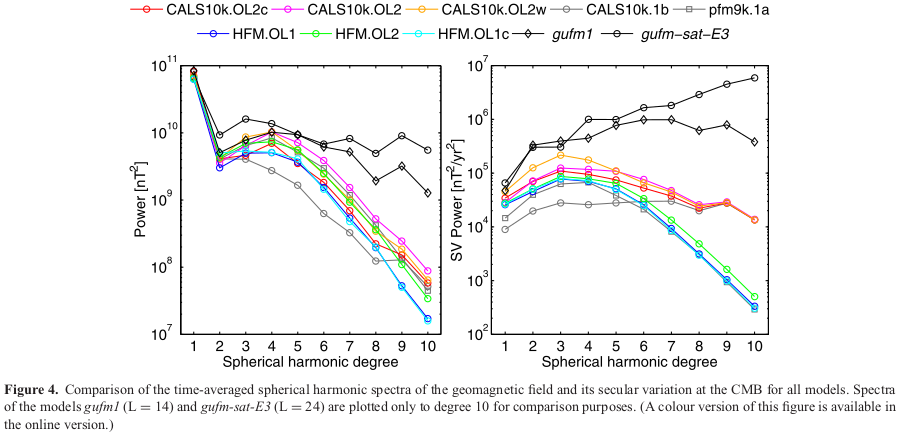

<!--
-------------------------------------------------------------------------------
This file defines the contents of each slide.
The reveal.js configuration can be found in index.html
-------------------------------------------------------------------------------
-->

<!-- .slide: class="slide-title" data-background-image="assets/background-faded.svg" data-background-color="#000000" data-background-size="contain" -->

<!-- Place the content at the bottom of the slide -->

<h3 id="talk-title">
  Limitations in paleomagnetic data and modelling techniques
and their impact on Holocene geomagnetic field models
</h3>

  <a>Yago Moreria Castro</a>

<!-- Place location and date side-by-side with affiliation logos -->

<i class="fa fa-calendar-alt" style="margin: 0 10px 0 0"></i>
21 de Junho de 2024

Seminário de Introdução ao Geomagnetismo

<!-- Permission to reuse and CC-BY license logo -->
<i class="fa fa-camera" style="margin: 0 10px 0 0"></i>
Sinta-se à vontade para tirar capturas de tela/compartilhar/reutilizar esta apresentação

<a href="https://creativecommons.org/licenses/by/4.0/"><i class="fab fa-creative-commons"></i><i class="fab fa-creative-commons-by" style="margin: 0 10px 0 2px"></i>CC-BY 4.0 License</a>

<!-- Add logos here. Need these wrappers to align them to the bottom right -->

  
  

===============================================================================
# Introdução
<h2 style="text-align: justify;">Modelos Globais do Campo Geomagnético</h2>

- Modelos são criados há 400 anos (Jackson et al. 2000);

- Permitem o mapeamento da evolução da estrutura do campo na superfície do núcleo da Terra.

- Usados para análises de variações globais e regionais do campo.

<h2 style="text-align: justify">Fontes de Dados Utilizadas</h2>

- 
Compilações de direções e intensidades do campo obtidas de artefatos arqueológicos, lavas e sedimentos. Em comparação com dados observacionais modernos ou históricos

===============================================================================

# Desafios Encontrados

- Dados arqueomagnéticos e paleomagnéticos contêm incertezas consideráveis.

  - Essas incertezas frequentemente não são bem compreendidas.

  - As incertezas afetam não apenas os valores dos campos magnéticos, mas também suas idades.

- A distribuição global desses dados é muito heterogênea.

===============================================================================
# Metodologias de Modelagem

- Diversas metodologias de modelagem foram testadas com o objetivo dessas metodologias é avaliar as influências dessas limitações.

# Série CALSx

- Cobertura dos últimos 3, 7 e 10 mil anos;
- Uso de expansões em harmônicos esféricos e funções base temporais de splines cúbicos;
- Aplicação de métodos de regularização;
- Objetivo: encontrar os modelos de complexidade mínima que se ajustem aos dados com a precisão desejada.

===============================================================================
# Licht et al. (2013)
- 
Apresentou três conjuntos de modelos de campo de baixo grau harmônico esférico (truncados nos graus e ordens 5) que abrangem os últimos três milênios.

- 
Modelos construídos a partir de conjuntos de dados arqueomagnéticos, vulcânicos e sedimentares.

- 
Apenas características de baixo grau podem ser resolvidas com os conjuntos de dados disponíveis.

===============================================================================

# Licht et al. (2013)
- 
Introduziram um erro de modelagem para contabilizar coeficientes de Gauss de ordem superior não modelados.

- 
Aumentaram o peso dos dados arqueomagnéticos em comparação com os dados sedimentares, devido a erros de cronometragem nestes últimos.

===============================================================================

# Nilsson et al. (2014)
- Considera questões de datação;
- Apresentaram novos modelos de campo geomagnético cobrindo os últimos 9000 anos;
- Utilizaram uma estratégia de modelagem nova;
  - Utilização de registros sedimentares reamostrados temporalmente de forma uniforme;
- Ajustes iterativos foram realizados nos escalonamentos dos registros sedimentares, considerando as incertezas nas idades.

===============================================================================

# SHA.DIF.14k

- Pavón-Carrasco et al. (2014b) propuseram um novo modelo de campo geomagnético holocênico;
- Cobertura dos últimos 14000 anos;
- Baseado exclusivamente em dados arqueomagnéticos e de fluxo de lava;
- Evita o uso de registros sedimentares.

===============================================================================

# Dados e Estimativas de Incertezas

  

  - 
CALS10k.1b foi construído usando dados paleomagnéticos que abrangem os últimos 10 mil anos;

  - 
A cobertura de dados é consideravelmente limitada no Hemisfério Sul;

  - 
Diferenças nos resultados são observadas devido ao tipo de dados utilizados (sedimentares vs arqueomagnéticos);

  

  

      
  

===============================================================================

# Dados e Estimativas de Incertezas

- O conjunto completo de dados inclui 85.500 pontos:

  - 4% sendo dados de declinação arqueomagnética;
  - 6% de inclinação arqueomagnética;
  - 5% de intensidade arqueomagnética absoluta.
  - Os dados paleomagnéticos de sedimentos contribuem com:
    - 35% para a declinação relativa;
    - 37% para a inclinação;
    - 13% para o Índice de Paleointensidade Relativa (RPI).

===============================================================================

# Inconsistênicas

- Korte & Constable (2011) identificaram queda suspeita na amplitude do RPI do Lago Pepin, EUA, entre 1800 AD e 2000 AD no CALS3k.3;
  - Diverge das informações históricas do campo magnético fornecidas pelo gufm1 (Jackson et al. 2000).
  - Parte do registro do Lago Pepin foi excluída antes da modelagem.

- 
O registro do Lago Biwa (BIW) (Ali et al. 1999) foi substituído por um novo registro do mesmo lago (BI2) (Hayashida et al. 2007) nos modelos CALS10k.1b (Korte et al. 2011) e pfm9k (Nilsson et al. 2014).

===============================================================================

# Metodologia de Modelagem de Campo

===============================================================================

## Modelagem direta e parametrização

$ V(r, \theta, \phi) =    a \sum_{l=1}^{L} \sum_{m=0}^{l} \left( \frac{a}{r} \right)^{l+1} [g_{l}^{m} \cos(m\phi)+ h_{l}^{m} \sin(m\phi)] P_{l}^{m}$

- A modelagem da evolução temporal do campo geomagnético requer uma expansão adicional dos coeficientes de Gauss \( $g_{l}^{m}$ \) e \( $h_{l}^{m}$ \) no tempo.
- Para isso, é adotada uma base de B-splines cúbicos.

$g_{l}^{m}(t)=\sum_{k}^{N_spl} g_{l}^{mk} B_k (t) $

$h_{l}^{m}(t)=\sum_{k}^{N_spl} h_{l}^{mk} B_k (t) $

===============================================================================

## Modelagem direta e parametrização

- Modelos usam grau harmônico esférico máximo de $L=10$ e espaçamento de pontos de nó temporais de 40 anos;
  - Mesma parametrização de Korte et al. (2011).
  - Permitem mais estrutura espacial e temporal do que os dados resolvem.

- Regularização espacial e temporal evita ajuste excessivo;
  - Garante que a resolução do modelo seja determinada pela informação nos dados e não por uma escolha arbitrária de truncamento da expansão harmônica esférica ou espaçamento dos pontos de nó das splines.

===============================================================================

# Erro

- Dados arqueomagnéticos e paleomagnéticos são coletados usando vários métodos de laboratório.
- A ausência de um procedimento padrão para estimar incertezas torna difícil caracterizar os erros dos dados estatisticamente.
- Comparações entre conjuntos de dados iniciais e finais e todos os modelos derivados indicam que os erros dos dados são mais bem representados por uma distribuição Laplaciana do que por uma Gaussiana.

===============================================================================

===============================================================================

# Resultados: Modelos de Campo de Holoceno

===============================================================================

# Propriedades globais dos modelos

- Modelo CALS10k.1b: Suavizado por médias de bootstrap, baixo poder espacial e resolução temporal, desajustes elevados aos dados.
- Modelos HFM e CALS: Espectros médios de coeficientes de larga escala são geralmente similares.
- Comparação com modelos modernos e históricos: Modelos milenares têm resolução limitada e médias temporais afetando graus 4 e superiores.
- Modelos HFM.OL1 e HFM.OL1c: Maior amortecimento resulta em menor complexidade espacial e rápida queda nos espectros acima do grau 4.

===============================================================================

===============================================================================

# Diferença em parâmetros dos modelos

- As figuras a seguir comparam a evolução dos coeficientes dipolo e quadrupolo dos modelos HFM e CALS10k, junto aos CALS10k.1b e pfm9k.1a como referência;
- A maior dispersão é vista nos coeficientes $g_{1}^{0}$, refletindo as diferenças nos fatores de escala RPI.
- Não há diferenças sistemáticas e persistentes visíveis nos coeficientes dipolo e quadrupolo equatoriais.
- O coeficiente $g_{2}^{2}$ de CALS10k.1b é  influenciado fortemente por registros australianos incorretamente orientados e inconsistências internas no Sudeste Asiático.

===============================================================================

===============================================================================

===============================================================================

# Variações Regionais

- Os deslocamentos de declinação são geralmente mais consistentes e robustos entre os modelos, com diferenças da ordem de apenas alguns graus a partir de um modelo inicial de dipolo axial.
- CALS10k.1b tratou os valores de declinação como absolutos, sem tratamento relativo.
- Algumas séries de declinação, como BAR na Austrália, apresentaram grandes deslocamentos devido à falta de verificação e ajuste de orientação nos modelos CALS3k.4 e CALS10k.1b.
- Grandes dispersões ocorrem naturalmente em regiões de altas latitudes próximas aos polos magnéticos, como na Península Antártica e Mar de Beaufort.

===============================================================================

# Discussões

===============================================================================

# Comparação entre previsão de modelos e dados locais

- A figura a seguir mostra exemplos de previsões dos modelos e ajuste aos dados para locais na Europa Central (EIF), Havaí (WAI), Austrália (GNO) e China (ERH).
- Todos os modelos concordam bem na Europa Central, onde há boa cobertura de dados arqueomagnéticos e sedimentares.
- No Havaí, todos os modelos, exceto CALS10k.1b, concordam na maior parte do tempo, com discrepâncias em intervalos curtos.
- Na Austrália, o modelo HFM.OL1c e CALS10k.1b mostram um claro deslocamento na declinação que não é compatível com o modelo de declinação média zero.

===============================================================================

# Comparação entre previsão de modelos e dados locais

- Na China, onde há suspeitas de influência de conjuntos de dados internamente inconsistentes, os modelos preveem resultados bastante semelhantes, com CALS10k.1b novamente sendo a exceção na inclinação.
- Nenhum dos modelos prevê a tendência de longo prazo mostrada pelos dados paleomagnéticos sedimentares entre 4400 a.C. e 2000 a.C. na declinação, considerando essa parte do registro incompatível com os dados regionais e globais restantes.

===============================================================================

===============================================================================

# Europa
  - Entre 2000 a.C. e 6000 a.C., há inconsistências nos dados de idade, com modelos concordando melhor com registros como Eifel Maars (EIF) e Furskogstjärnet (FUR), mas menos claramente com Nautajärvi (NAU) e Lagos Finlandeses (FIN).
  - O modelo SHA.DIF.14k mostra alta variabilidade em torno de 4500 a.C., não suportada por registros paleomagnéticos sedimentares.
  - Em 7000 a.C., há um mínimo claro de inclinação consistentemente mostrado pelos registros, previsto por pfm9k.1a e CALS10k.OL2c, mas não por SHA.DIF.14k devido à escassez de dados naquela época.
  - A falta de dados no SHA.DIF.14k implica que variações regionais não são resolvidas na metade inicial do modelo, podendo distorcer previsões de inclinação do dipolo.

===============================================================================

===============================================================================

# Comparações entre modelos

- Comparação do campo radial não axial médio (NAD) na fronteira manto-núcleo:
  - Os modelos são concordantes para grandes escalas;
  - Diferenças significativas em detalhes menores, especialmente na Austrália/Sudeste Asiático.
  - Problemas de orientação de declinação afetam o modelo CALS10k.1b.
  - Estruturas médias NAD mostram campos positivos em baixas latitudes e negativos em altas latitudes.
  - Regiões equatoriais e de baixas latitudes são mais consistentes entre os modelos.

===============================================================================

# Comparações entre modelos
- Comparação do campo radial não axial médio (NAD) na fronteira manto-núcleo:
  - Média NAD concorda bem com pfm9k.1a e CALS10k.1b, exceto na região Austrália/Indonésia/Pacífico Oeste.
  - Modelo SHA.DIF.14k mostra diferenças claras em relação aos outros modelos.
  - Maior variabilidade no campo NAD médio é encontrada na região polar norte, Antártica Ocidental e Sul da América do Sul.
  - Campo NAD no polo norte varia entre os modelos, com algumas inconsistências.

===============================================================================

===============================================================================

===============================================================================
# Conclusões

- Seis novos modelos de campo geomagnético para o Holoceno foram construídos, baseados em dados paleomagnéticos e arqueomagnéticos.
- Modelos previamente publicados, CALS10k.1b e pfm9k.1a, foram incluídos nas comparações.
- Modelos são mais sensíveis à ponderação relativa dos dados e ao escalonamento da intensidade relativa e offsets de declinação do que às diferenças na metodologia de modelagem.

===============================================================================
# Conclusões

- A recuperação da força absoluta do dipolo axial (DM) permanece um desafio devido à escassez de dados de intensidade absoluta.
- Registros de sedimentos são essenciais para descrever a variabilidade regional do campo antes de 1000 a.C., mas requerem ajuste de orientação e escalonamento de intensidade relativa (RPI).
- As intensidades arqueomagnéticas podem ser enviesadas devido a correções inadequadas de magnetização termorremanente (TRM).
- Ajustes de orientação podem ser enviesados pela suposição inicial de dipolo axial geocêntrico (GAD) em áreas com poucos dados de declinação.
- Estimativas de incerteza dos dados são cruciais para determinar estruturas de campo confiáveis e variações.

===============================================================================
# Conclusões
- O tratamento adequado das incertezas de idade nos registros de sedimentos permanece um desafio.
- A escolha dos parâmetros de regularização e ponderação dos dados determina a quantidade de estrutura espacial e temporal nos modelos.
- A rejeição de outliers é importante para a criação de modelos consistentes.
- A qualidade dos dados e a disponibilidade de estimativas realistas de incerteza são mais importantes que os detalhes das escolhas de modelagem.
- Mais dados são necessários, especialmente no hemisfério sul e em períodos mais antigos, para melhorar a cobertura e resolver ambiguidades.

===============================================================================
<!-- .slide: class="slide-contact" data-background-image="assets/background-faded.svg" data-background-size="contain" data-background-color="#000000" -->

<i class="fas fa-comments"></i>
 
Contato:
<a href="yagomcastro@usp.br">yagomcastro@usp.br</a>

<i class="fab fa-github"></i>
 
Código-fonte para esta apresentação:
 
[github.com/YagoMCastro/geomag-seminario2-msc-2024](https://github.com/YagoMCastro/geomag-seminario2-msc-2024)

<i class="fab fa-creative-commons"></i><i class="fab fa-creative-commons-by"></i>
 

Salvo indicação em contrário,
o conteúdo desta apresentação está
licenciado sob a
 
[Creative Commons Attribution 4.0 International License](https://creativecommons.org/licenses/by/4.0/).

